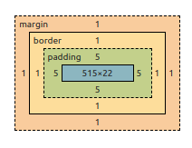

# Presentación

El objetivo **principal** de la presentación es que la información de una página se transmita de forma clara y eficiente, la parte estética es un objetivo secundario.

## 0. Linter Stylelint

### 0.1 Instalar

```
npm install --global stylelint stylelint-config-standard
```

### 0.2 Ejecutar

```
npx stylelint "**/*.css"
```

Ejecute el comando desde la raíz del proyecto, este le detectará errores de los archivos .css

## Hojas de estilo en cascada de CSS

### 1.1 Generalidades de las hojas de estilo

Las reglas de estilo le dan propiedades a los elementos, una regla tiene esta forma:

```css
selector { declaration }
```

El `selector` indica a cuales elementos se le aplican los estilos especificados en `declaration`. Ejemplo:

```css
h1, h2, h3, h4, h5, h6 { color: green; }
```

La parte de la izquierda es una **propiedad** y la derecha es un **valor**.

Cada elemento lo podemos ver como un objeto de OOP, le alteramos los "atributos" al objeto que tienen que ver con su **presentación**.

#### 1.1.1 Donde ubicar las reglas de estilo

Ordenado por prioridad, el que esté más arria es el que gana:

1. En una hoja de estilos externa provista por el visitante (no por el autor). Esto ya no se hace mucho, era navegadores antiguos como `Opera`

2. En el elemento mismo con el atributo `style`. Esta sí la podemos controlar, la anteorior NO. Esta no se recomienda ya que no permite redundancia de código, si quiero que distitnos elementos tengan el mismo estilo, tendré que ir aplicándoselo a cada uno manualmente redundando el código.

3. En el encabezado del documento web, con el elemento `<style>`. Esta forma sigue el formato de regla:

```css
selector { declaration }
```

El cual sigue un lenguaje de consultas ([selectors](https://www.w3.org/TR/selectors-4/)), tiene su propia sintaxis para referirse a elementos.

Esta forma tiene un problema, el html tiene el trabajo del contenido (hacer las cosas semánticas), no debe encargarse del estilo por lo que lo hace menos eficiente para darle mantenimiento y además de que para servir 100 mil páginas, cada pag va a tener ese estilo en el html.

4. En un archivo .css eterno que se liga al xhtml con el elemento `<link>`. Esta es la mejor forma de hacerlo, enlazamos el .css a nuestro html.

5. En la implementación del navegador

#### 1.1.2 El principio de cascada

Es la forma en que el agente de usuario sabe que regla debe aplicar, ya vimos que hay cierta jerarquía dónde están escritas las reglas.

1. Principio de espicificdad: Si 2 reglas compiten por el mismo elemento, entonces se aplica aquella que especifique cuál es el elemento, ejemplo:

```css
body {
  color: turquoise;
}

body li {
  color: brown;
}
```

El elemento `body` y sus descendientes quedarán de color turquesa excepto los elementos `li` descendientes de `body` los cuales quedarán de color café.

2. Principio de ubicación: Si dos reglas por la misma propiedad tienen misma especificidad, se tomará la que aparezca de último (el que esté más cerca del elemento), por eso vimos la jerarquía de antes. Ejemplo:

```css
body {
  color: turquoise;
}

body {
  color: brown;
}
```

El elemento body y sus descendientes quedarán de color brown ya que aparece de último.

3. Principio de herencia: Cuando no hay una regla de estilo, el navegador aplica el estilo del elemento padre si la propiedad es **heredable** por defecto. La fuente es heredable pero no el margen por ejemplo.

```css
body {
  color: turquoise;
}

body {
  color: brown;
}
```

### 1.3 Valores de propiedades

Los valores que toman las propiedades son de varios dominios

### 1.4 Módulos y propiedades

El profe recomienda aprender primero sobre la teoría de la presentación, cosas de diseño gráfico. Y ya después módulos de CSS.

[Ver este material](https://jeisson.ecci.ucr.ac.cr/appweb/material/#css_properties)

#### 1.4.1 El modelo de caja

De los más básicos que hay, dice que **TODO** elemeento tiene una *caja* alrededor.



- El color azul significa el contenido del elemento
- El naranja representa el margen, recordemos que el margen es la separacion del elemento con los elementos vecinos
- El verde representa padding, el cuál es la separación entre el borde y el contenido
- El amarillo representa el borde, es la distancia entre el margen y el padding, este puede tener color de fondo.

Utilizar este modelo funciona mucho cuando queremos distinguir elementos muy distantes entre si, como el encabezado y el pie de página.

**NOTA**:
- Pseudoelemento: es un elemento cuando le pasa algo, para indicarlo le agregamos `:` al selector

#### 1.4.2 El modelo de flujo

Indica dónde se deben ubicar los elementos dentro del documento cuando se renderea. Por ejemplo; el body ocupa todo el ancho de la página, las imágenes ocupan sólo lo que necesitan, las listas ocupan todo el ancho y su altura depende de sus hijos. El head toma el ancho del papá, y así más ejemplos.

Podemos alterar este flujo, haciendo que elementos de bloque sean eleemntos de línea por ejemplo, esto lo hacemos utilizando modelos de posicionamiento.

#### 1.4.2 El modelo de flex box

(Pagina para probar flex boxes)[https://the-echoplex.net/flexyboxes/]

- Contenedor: elemento padre del cuál queremos posicionar sus hijos
- flex-direction: dirección en que se van a colocar sus hijos, puede ser `row` o `column` (o también row-reverse y column-reverse)
- 

### 1.4.5 EL modelo de fuente

Principalmente debemos pensar en familias de fuentes sin serifas, con serifas y monoespaciadas. Normalmente hay un número limitado de fuentes que están disponibles en todos los OS por lo que existen servicios de fuentes como el de Google. Este permite importar una fuente a nuestro CSS, funciona muy bien ya que puede que el navegador ya tenga la fuente en la caché por viistas previas a otros sitios web que también importaban la fuente que nosotros utilizamos, esto ahorra ancho de banda. Se recomienda tener 3 máximo 3 fuentes distintas para ahorrar recursos. Para ver como importar la fuente vea [Modelo de tipografía. Fuentes de Google. Espaciado de líneas y caracteres](https://jeisson.ecci.ucr.ac.cr/appweb/2021a/lecciones/0513-css3/font_model-google_fonts-line_char_spacing.mp4)

## 1.5 Elementos en línea

Existen de dos tipos, reemplazados y no reemplazados

reemplazados: El contenido NO está en el documento, como las **imágenes** que su contenido viene de otro lado. Su `witdh` y `height` pueden ser cambiados.

No reeemplados: El contenido está en el documento, no se le puede cambiar el `width` ni el `height`, el navegador es quien pone estos tamaños

## 1.6 Responsive

Que nuestro producto tenga adaptación con cada display

### 1.6.1 Media Queries

Cuando ligamos una hoja de estilos, especificamos en que tipo de `media` se va a renderear, ejemplo:

```xhtml
<link rel="stylesheet" media="screen" href="css/screen.css"/>
```

Pero los media queries pueden también especificarse en CSS. Vea [using media queries](https://developer.mozilla.org/en-US/docs/Web/CSS/Media_Queries/Using_media_queries)

```css
@media (max-width: 950px) {
  /* propiedades */
  body {
    color: red;
  }
}
```

El ejemplo anterior indica que cuando el ***viewport*** (ancho de la ventana) es menor o igual que 950px, entonces se aplicaran las propiedades

### 1.6.2 Metadato View port

```xhtml
<meta name="viewport" content="width=device-width, initial-scale=1"/>
```

Los celulares tratan de ver la página como si fueran un navegador de escritorio por defecto, pero esto poco responsive. El ViewPort que vimos indica que el `width` de la pantalla sea igual a la pantalla del celular no al de la página.

### Modelo Animation

[link de documentación](https://developer.mozilla.org/es/docs/Web/CSS/animation) 

La transición es una animación predefinida, pero si queremos algo más complejo, podemos controlar cada pedazo de la animación

Para usar estas animaciones utilizamos `keyframes`, es como definir una nueva funcion que tieen control sobre el tiempo de la animacion

```css
p {
  animation-duration: 3s;
  /* el animation name indica el elemento al que le voy a aplicar la funcion de animacion */
  animation-name: slidein;
  /* no es necesrario, pero si queremos esepcificar la cantidad de veces que se hara la animacion entonces usamos esta propiedad, ene ste caso se hara infinita cantidad de veces */
  animation-iteration-count: infinite;
}

@keyframes slidein {
  /* from equivale al 0% del tiempo */
  from {
    margin-left: 100%
    width: 300%;
  }

  /* podemos defini mas porcentajes */
  75% {
    font-size: 300%;
    margin-left: 25%;
    width: 150%;
  }

  /* es el 100% */
  to {
    margin-left: 0%;
    width: 100%;
  }
}
```

Puede utilizr [Animista](animista.net) para probar animaciones y luego simplemente pasarlas al archivo `css`

## Preprocesadores

El preprocesador de css más usado es [Sass](https://sass-lang.com/), funciona igual que el preproceador de `C`.

Funciona mucho para generar Macros, es decir, tener una "funcion" que podamos usar una y otra vez sin necesidad de escribir tood el codigo.
