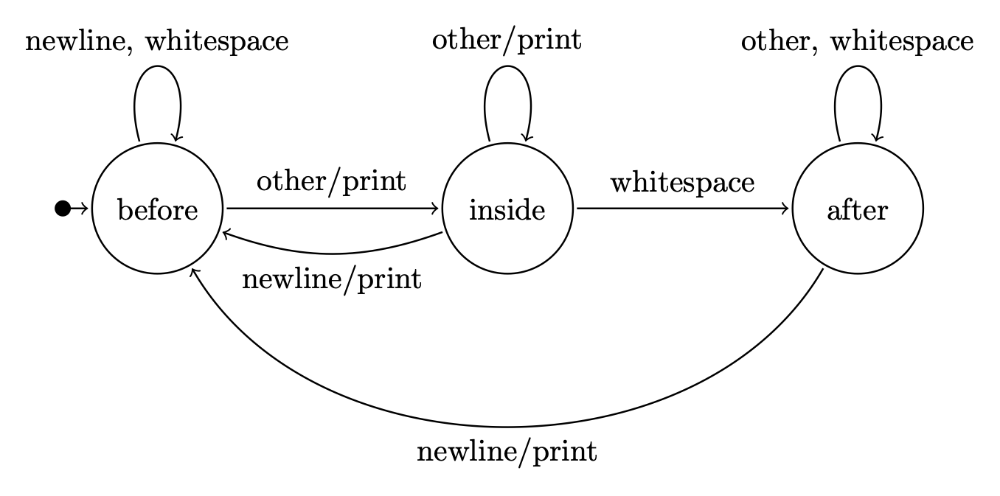
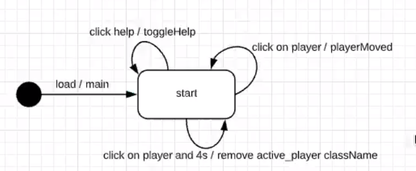

ver en MDN Web Docs la docuemntación que necesite y ECMAScript para ver el estándar que se aplica en Javascript.

# Comportamiento

Se refiere a programas de computadora que cambian la forma en que se experimenta el contenido, se refiere mucho a eventos. Hay dos formas de comportamiento, el comportamiento del lado del servidor y el comportamiento del lado del servidor.

* Cliente: El estándar es JavaScript
* Servidor: Podemos utilizar lo que queramos, el más popular sigue siendo PHP, es sumamento probable que nos lo encontremos en la calle. Sin embargo podemos usar cualquier lenguaje que permite hablar red, que permita hilos y sockets. Pero también queremos tner acceso a archivos, a bases de datos. También protocolos seguros, hay ambientes que ofrecen bibliotecas que permiten hacer estas cosas y se hacen populares por esto. C++ no es un caso de esto último. La tecnología NodeJS permite también implementar esto en el lado del servidor. También surgen nuevas tecnologías como Go (lenguaje que pretende optimizar el **tiempo de programacion**), es un lenguaje compilado por lo que es más rapido que Java, JS, PHP, Python.

## 6.1. Ambientes de ejecución

### 6.1.2. Código en los eventos intrínsecos

Se puede especificar código JavaScript en los eventos intrínsecos de ciertos elementos, tales como `onload`, `onmouseover` y `onclick`, como se ilustra en el Listado 55. Este código JavaScript es ejecutado únicamente si el evento es accionado. El código para los eventos intrínsecos no se debe incluir en el documento (X)HTML, sino que debe ser asignados dinámicamente desde un archivo .js, como se estudiará en un capítulo posterior.

### 6.1.3. El elemento `<script>` y la consola web

```html
<body>
   <h1>Cuadrados naturales</h1>
   <script type="text/javascript">
      'use strict';
      document.write('<ul>\n');
      for ( let n = 1; n <= 20; ++n )
         document.write('. ', n, '<sup>2</sup> = ', (n * n), '\n');
      document.write('</ul>\n');
   </script>
</body>
```

Mientras el navegador está cargando un documento web, va mostrando sus elementos (títulos, párrafos, imágenes, tablas, etc.) a medida que los encuentra. Lo mismo pasa con los elementos <script>. Inmediatamente que el navegador encuentra un elemento <script>, ejecuta el código que se encuentra en su contenido, línea a línea. El atributo type indica el MIME type del lenguaje de programación utilizado por el script. Si se omite, en (X)HTML5 se asumirá "text/javascript" y se considera una mala práctica hacer explícito este valor por defecto como se hizo en la línea 3 del Listado 56, por lo que no se volverá a incluir en el resto del material.

el objeto `document` que representa al documento web cargado en el navegador. El método document.write() recibe una lista de valores separados por coma y su salida es insertada como código HTML inmediatamente después del elemento` <script> `que lo invoca, es decir, su invocación altera la estructura del documento. Una vez que el `<script>` ha terminado su ejecución, el navegador continúa procesando el resto del documento como de costumbre, y procesará tanto el código provisto por el autor en el documento original como el código insertado con document.write() tras ejecutar el `<script>`

**El uso del método `document.write()` se considera una pobre práctica** de programación. De acuerdo al W3C, en XHTML el objeto document no dispone de este método, ya que XML prohíbe modificar el documento mientras éste se esté analizando

### 6.1.5. Código JavaScript en un archivo externo


## Tipos de datos primitivos

### Cadenas de caracteres

Cada caracter corresponde a un entero de 16 bits, maneja Unicode. Por tanto la cadena "hola" está consumiendo 4*16 bits. Este Unicode permite manejar acentos y demás cosas.

Al ser un tipo de datos primitivo, al ser pasada una cadena por parámetro, esta se envía por copia. Son además inmutables; osea que si modifico la cadena, realmente está creando una nueva cadena con el nuevo contenido.

Aunque son datos primitivos, se pueden covnertir temporalmente en objetos, ejemplo;

```javascript
lea str1 = "hola mundo"
```

No es una referencia a la cadena de caractres, es simplemente la cadena. Sin embargo se le pueden llamar métodos.

```javascript
str1.replace('a', 'e')
```

Lo anterior da como resultado que `str1` diga <code>"hole mundo"</code>. Lo que está pasando es que Javascript crea un objeto string temporalmente en donde copia lo de str1. De esta forma se le logran llamar métodos.

Javascript no tiene tipo de datos `char`, esto implica cosas importante. Por ejemplo, si tenemos un parser que va sacando letras y dependiendo del caracter toma una decisión a la vez. Si se hace en Javascript, esto va a ser la coasa mas ineficiente que se puede hacer, significa que cada caracter se va a trabajar como una cadena de caracteres a la vez. Entonces lo que uno hace es en lugar de trabajar chars a la vez, mejor trabajar oraciones a la vez, muchas veces se usan expresiones regulares para esto.

Las comillas simples o dobles da igual en Javascript, usaremos simples porque es el estándar en Airbnb.

El operador + en cadenas funciona igual que en Java donde la cosa se convierte a cadena.

```javascript
let username = 'luis';
let greeting = 'Hi: ' + username
```

Con el estándar de Airbnb se hace de otra forma; utilizamos una expresión en lugar de username. A esto se le llaman *template strings*

```javascript
let greeting = 'HI $(username.toUperCase())';
```

Para ver distintas fucniones interesantes de strings diríjase a [Strings](https://jeisson.ecci.ucr.ac.cr/appweb/material/#js_strings)

### Variables vs valores. Declaraciones var let y const

Las variables se declaran mediante las palabras reservadas let, var y const. Sin embargo una variable tiene tipo de datos dinámico, va a depender del valor que se le asigne.

El var lo que hace es que la declaración de una variable la pone al puro inicio de la subrutina y permite que se use en cualquier parte de la subrutina. **Es PÉSIMA PRÁCTICA DE PROGRAMACIÓN**.

### Conversiones de tipos

Operador de concatenación

### booleanos

Son almacenados como enteros. Los valores especiales `NaN` (para flotantes(recordemos que en js todos lo númeos se manejan como flotantes)), , `null`, `undefined` y la cadena vacía ("") siempre se convierten a `false`; todos los demás a `true` como `infinity` (para flotantes).

`null`: palabra reservada que significa; es una referencia a ningún objeto, es igual a cuando teníamos un puntero en c++ y le poníamos nullptr. Ejemplo, tengo objetos almacenados en un arreglo, defino un patrón y quiero que me retorne el objeto que cumpla el patrón, no encontró ninguno entonces retorna `null`.

`undefined`: Condición anormal, es cuando algo no existe, normalmente se usa para variables. Ejemplo; prefunto por el atributo de un objeto, pero este atributo no existe (tal vez porque lo escribí mal) entonces js retorna undefined en lugar de lanzar una excepción o algo así. O si declaro una función que no retorna nada, y trato de guardar su valor de retorno en una variable entonces también el valor será `undefined`.

EL operador `==`: Este operador permite conversiones igual al operador `+`, por lo que en muchas situaciones puede ser problemático para nuestro objetivo. Un ejemplo de conversion es que `"" == false` da como resultado `true` ya que convierte lo de la derecha a cadena.

El operador `===` y `!==`: Este obliga a que ambos operandos sean del mismo tipo. El `!==` simplemente niega el `===`.

## Intérprete

### Construir un intérprete hipotético. La clase Variant

Un intérprete hace el trabajo usual de un compilador, debe trabajar con puro texto, hace un análisis sintáctico. Si es correcto entonces revisa la gramática. El código js (similar a Java) se "compila" a un bytecode que se guarda en memoria.

Para ver el ejemplo de intérprete hipotético vaya a [js.cpp](../../../examples/Javascript/interprete/js.cpp)

## Tipos de datos compuestos

Son tipos que pueden tener múltiples valores, en el fondo son composiciones de varias primitivos u otros compuestos.

### Objetos

JS es un lenguaje parcialmente orientado a objetos. Las clases se agregaron recientemente, antes existían objetos SIN CLASES. En JS los objetos son **arreglos asociativos**, es decir, de un mapa (`#include <map>`) en C++.

```Javascript
image.width
image.height
document.myform.button
console.log('log es un método: una propiedad cuyo tipo de datos es una función');
```

Pero al ser mapas también podemos hacerlo de esta forma:

```Javascript
image['width']
image['height']
document['myform']['button']
console['log']('log es un método: una propiedad cuyo tipo de datos es una función');
```

La forma de crear un objeto sería utilizando la notación de objetos de Javascript que es conocido como `Json`. Tiene limitaciones como que no puede tner comentarios y todo tiene que estar dentro de comillas **DOBLES**.

```js
// en js las {} sirven para cuerpos de subrutinas y para crear objetos
let player = {
   name: "Chema",
   score: 0,
   lastsLevel: 30
}

player.personalInfo = {}

plater.personaInfo = 
```

Como vemos es fácil agragarle nuevas propiedades a los objetos, se hace de forma dinámica. Podemos agregar o eliminar propiedades cuando queramos. Además un objeto también es un **`Variant`**, entonces un Variant tambi[en puede ser un objeto]

Para eliminar una propiedad:

```js
delete playe.personalInfo;
```

La paralabar `delete` no tiene nada que ver con eliminar memoria dinámica, Javascrip al igualq ue `Java` tiene un recolector de basura y lo hace de forma automática por nosotros.

```js
function crearPersona()
{
   const nuevaPersona = {
      nombre: valorAleatorio(nombres) + ' ' + valorAleatorio(apellidos),
      edad: Math.round(Math.random() * 110),
      ingreso: Math.floor(Math.random() * 1000) + ',000'
   };
   return nuevaPersona;
}
```

El ejempl anterior, implica que cada vez que se llame la funcion crearPersona, se va a crear un objeto nuevaPersona diferente. Es decir, el operador `{ }` cada vez que se evalúa, va a crear un nuevo objeto.


### Notación JSON

Permiten la serialización, es una notación muy compacta. Permite serializar datos en documentos. Un ejemplo de su uso es cuando en un videojuego si se conecta alguine nuevo a la sesión, los demás jugadores deben saber que alguien más se conectó, entonces se envían estos mensajes JSON. 

### Arreglos

Vaya a [Arreglos](https://jeisson.ecci.ucr.ac.cr/appweb/material/#js_arrays) para ver métodos interesantes de los arreglos.

```Javascript
let a = new Array();                // Arreglo vacío, lo mismo que: let a = [];
a[0] = 1.2;                         // Un elemento es insertado en la posición 0
a[1] = "JavaScript";                // Un elemento es insertado en la posición 1
a[2] = true;
a[4] = { x:1, y:3 };                // La posición 3 tiene un elemento con el valor undefined
a[5] = (x) => { return x * x; };    // a[5](7) retornará 49
a[6] = [];                          // Elemento a[6] almacena un arreglo vacío
a[6][0] = -Infinity;                // Inserta un elemento en el arreglo que está en a[6]
console.log(a.length);              // Imprime la cantidad de elementos en el arreglo: 7
delete a[6];                        // Elimina el último, pero a.length se mantiene en 7

let b = new Array(1.2, "ES6", true, {x:1, y:3});
console.log(b.length);              // 4 elementos

let c = new Array(10);              // Arrreglo de 10 elementos indefinidos
console.log(c.length);              // Imprime 10 y no 1
```
 
En C, C++ y Java, los arreglos son regiones de memoria contínua con datos del mismo tipo. En JS los arreglos son objetos, esto implica que se manejan como mapas (vaya a [js.cpp](../../../examples/Javascript/interprete/js.cpp) para ver cómo se interpreta en c++). Asocian números enteros con `Variant`.

Por tanto el acceso a los elementos de no será en tiempo O(1), ahora será en O(log(n)). Sin embargo esto puede cambiar con el tiempo, los intérpretes pueden diseñarse de forma que optmizen estas cosas.

Los índices son cadenas de caracteres debido a que al ser un objeto, se asocian strings con Variant, por lo qu ese hace la conversión de número a string. 

Además, como los arreglos heredan de los objetos, entonces puedo asociar a cada índice del arreglo, el valor que yo quiera, puedo poner en la posición 0 un objeto y en la 1 un string:

```js
// en js las {} sirven para cuerpos de subrutinas y para crear objetos
let player = {
   name: "Chema",
   score: 0,
   lastsLevel: 30
}

let players = [];
players[0] = player;
players[1] = 'hola';
players[3] = 53;
```

Pueso dejar índices sin definir, osea que nunca los uso por lo tanto en el arreglo asociativo nunca se crean. Por ejemplo, en el código anterior, sin intent acceder a `players[2]` me retornará un `Variant` con el `value` en `undefined`, para esto llama a `operador[]` que retorna una vopia de `Variant`.

También puedo asociar strings con lo que sea y estos se ponen "al final" del arreglo:

```js
players["count"] = 5;
```

Sin embargo, estos elementos no son tomados en cuenta en la propiedad `length` del arreglos, es decir que para el código anterior `players.length == 4`.

### Funciones

Las funciones no son iguales a C++, Java o C. También son objetos. Formas de declarar funciones en JS

```javascript
// Una función nombrada
function square1(x) { return x * x; }

// Una función literal o lambda
// Al Linter no le gusta
const square2 = function(x) { return x * x; }

// Esta si le gusta al linter
const square5 = function square(x) { return x * x; }

// Una función construida a partir de textos
const square3 = new Function("x", "return x * x;");

// Otra función lambda o "función flecha"
const square4 = (x) => { return x * x; }

// Invocar las funciones
square1(2.0); // 4
square2(3.0); // 9
square3(4.0); // 16
square4(5.0); // 25
```

La razón de que sean objetos (es decir, tienen un arreglo asociativo) es porque heredan la forma que se trabaja el **paradigma de progra funcional**, un libro sobre este paradigma sería (SICP - MIT)[https://en.wikipedia.org/wiki/Structure_and_Interpretation_of_Computer_Programs,_JavaScript_Edition].


## Javascript del lado el cliente

### Paradigma de programación orientado a eventos

#### Evento

Se refiere a un estado del programa que puede que darse en cualquier momento o directamente nunca darse. Los eventos en JS se refiere por ejemplo a que un elemento sea clickeado.

#### Event-handler

Se refiere al encargado de manejar el evento, en JS es una funciión que se asocia a un evento específico ocurrido en un elemento de HTML. Cuando se produce el evento el navegador llama a la función event handler asociada.

#### Queue-event

La cola de eventos se refiere a que los eventos se encolan y luego se ejecutan en el orden en que se agregaron. Normalmente se hace mediante un ciclo de eventos.
En Javascript, cuando ocurre un evento este se encola.

#### Event-loop

Extrae los eventos de la cola y ejecutarle a este evento todos los event-handler asociados

```python
while true:
   Event ev = queue.pop()

   if ev == Event::exit():
      break

   for (handler of ev.handlers) :
      handler(ev)
```

### Eventos y objetos, encapsulación

Se recomienda mucho ver el archivo [homepaje.js](../../../examples/board_game%20_1/js/homepage.js)

### Posicionamiento absoluto y relativo. Estilos computados

Cuando inspeccionamos una página, veremos una pestaña styles, esta pestaña indica todos los estilos aplicados de acuerdo a las hojas de estilo que hayamos definido.

Los estilos computados en cambio, se refieren a los estilos finales aplicados a los elementos de una página después de que se hayan resuelto todas las reglas de estilos y se hayan aplicado las cascadas y herencias.

Entonces, con Javascript yo puedo modificar los estilos. Si quiere modificar los estilos que se cargaron después de las hojas de estilo, haría algo como

```js
this.element.style.left = '%50'
```

### Aplicar transiciones a una propiedad cambiada con JS

### Cambiar la clase de un elemento con JS. Temporizadores con setTimeout()

**Cambiar la clase de un elemento con JS.**

Con Javascript podemos agregarle una clase a un elemento, esto puede servir si por ejemplo tengo un elemento de clase player que quiero agregar una clase que se llame active_player representando a un player pero con algo agregado, como estilos propios con css.

POr ejemplo quiero agregarle una sombra roja a un jugador de clase active_player.

```css
.active_player {
   filter: drop-shadow(5px 5px 5px red);
}
```

Entonces en JS lo que haría es:

```js
this.element.classList.add('active_player')
// this.element.className
```

EL classLIst convierte las clases de un elemente en una lista, entonces yo puedo agregar una nueva clase a la lista con el método add. Con className lo que hago es obtener el string de las clases, osea si el HTML hay:

```html
<td class="board_cell circle1"/>
```

Entonces el className será la cadena `"board_cell circle1"`

**Agregar temporizadores**

Si yo quiero que un evento se de después de cierta cantidad de tiempo entonces registro un evento en el objeto window.

* setTimeout: Quiero que dentro de cierto tiempo ejecute una subrutina

* setInterval: Quiero que ejecute una subrutina ciclicamente, osea cada cierto tiempo la ejecute.

* setInmediate: Pongo un evento en la cola y quiero que lo ejecute apenas llega al final de la cola.

Vea el codigo [javascript](../../../examples/board_game%20_1/js/homepage.js)

### Mostrar/ocultar (toggle) un elemento de ayuda

Para mostrar y ocultar un elemento se deben hacer varias cosas:

1. Definir un botón que muestre el elemento en pantalla en nuestro html. Por ejemplo, si quiero un botón que muestre la ayuda en un videojuego haríamos algo como:

```html
<main>
   ....
   <button id="toggle_help">Ayuda</button>
   ...
</main>
```

2. Definimos otro elemento con el contenido de la ayuda y le ponemos un display de none para indicar que no se deme mostrar en pantlla

```html
<main>
   ...
   <section id="help">
      <h3>Como jugar</h3>
      <p>Aqui va el texto que explcia como jugar</p>
   </section>
</main>
```

```css
#help {
   display: none;
}
```

3. Utilizar Javascript para manejar los eventos de este botón.

## Eventos y máquinas de estados

### Concepto de máquina de estados



Cada círculo representa un estado el cuál lo podemos ver como el estado de la memoria de la computadora. Para pasar de un estado a otro debe ocurrir un **evento**. Además cada flecha (la cual representa un evento), podemos indicarle quién es el maneador de ese evento. Por ejemplo, es el evento es que se tiene una nueva línea en algún texto entonces podríamos querer imprimir esa línea: newline/print. El newline es el evento y el print su manejador.

Se recomienda primero crear maquinas d eestado antes de otro tipo de diseño.



Para nuestro ejemplo del tablero inicial podríamos tener que el estado start tiene 3 eventos que hemos ido programando; la ayuda, mover jugador, y que el jugador deje de ser activo.